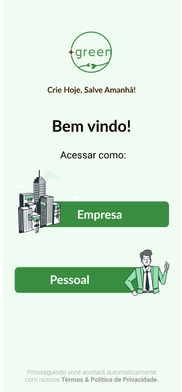
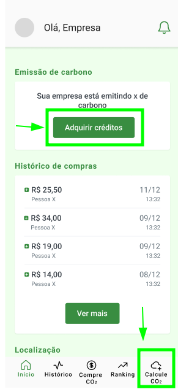
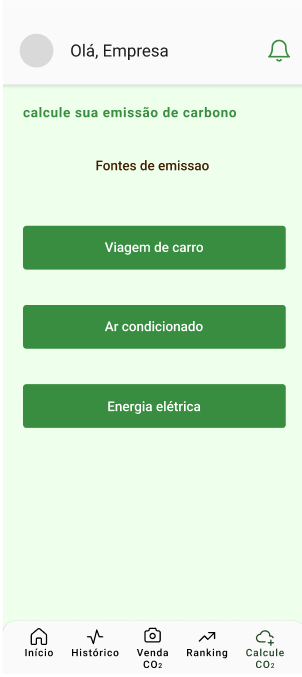
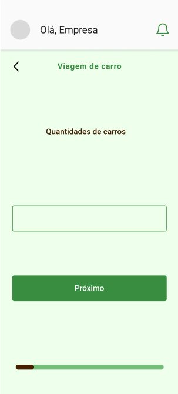
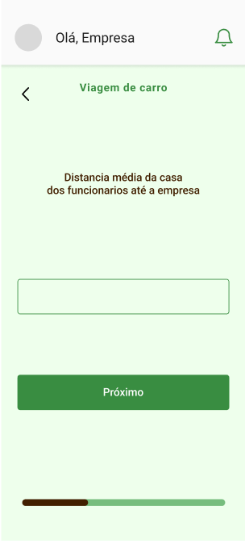
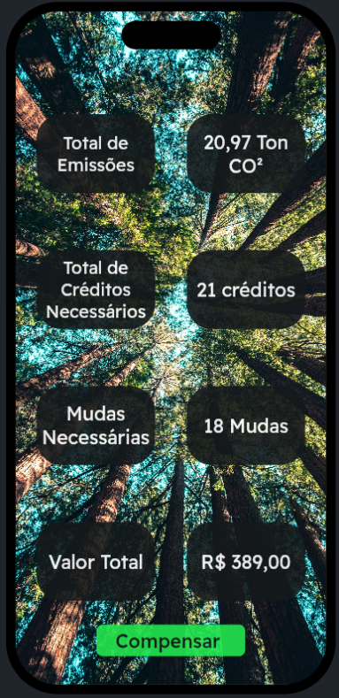
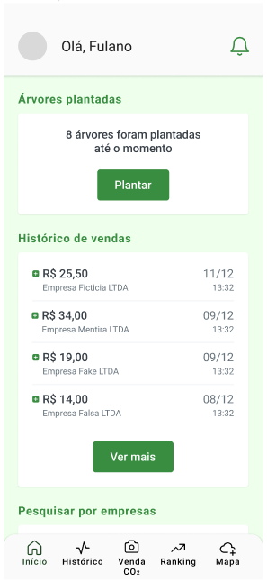
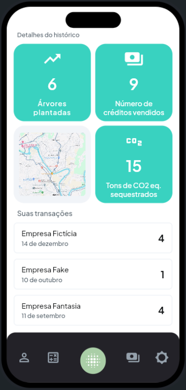
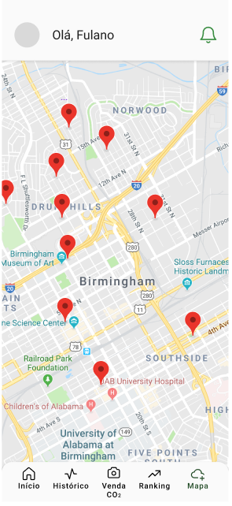

# Introdução 🏁

#### O aplicativo +green tem como problemática a emissão de CO2 por escritórios e apresentamos a solução com o plantio de árvores por parte dos usuários não relacionados diretamente aos escritórios.

#### Definimos um escritório como sendo uma área compartilhada por vários funcionários que não emite CO2 via emissões diretas (i.e. queima de combustíveis fósseis). Consideramos também que estes escritórios emitem CO2 das seguintes formas: 

- Translado dos funcionários até a empresa;
- Ar-condicionados;
- Emissão indireta via consumo de energia elétrica.

#### Para solucionar este problema utilizaremos como estratégia de mitigação o plantio de árvores.

#### Cada usuário poderá plantar uma árvore que será rankeada de acordo com a categoria de extinção (IUCN), o CO2 estocado pela planta e seus co-benefícios como, por exemplo, a zoocoria (dispersão realizada por animais), impulsionando a biodiversidade local.

#### Deste modo, para que os escritórios possam ser considerados "carbon neutral" eles utilizarão o marketplace disponível em nossa aplicação que mostra as árvores e o seu valor buscando mitigar as emissões de CO2 dos escritórios e fazendo quem plantou lucrar de forma sustentável.

## Front-end 💻

#### Com um Front-end simples e dinâmico dividimos a aplicação "+green" em duas partes, sendo elas:

- ##### Módulo Empresarial
- ##### Módulo Pessoal

#### A seguir, a tela para escolher qual módulo prosseguir:

 

## Módulo Empresarial 💼

#### 📌 Após o cadastro do escritório o usuário poderá:

- ##### Adquirir créditos de carbono provenientes dos plantios resultantes do módulo pessoal;
- ##### Calcular suas emissões referentes ao período de um ano.

 

#### Consideraremos as emissões provenientes de translados dos funcionários, ar-condicionados e gastos energéticos.

 

#### 📌 Para calcular as emissões de CO2 por translado dos funcionários o usuário responsável por fornecer os dados deve dar como input:

- ##### Números de carros utilizados pelos funcionários;
- ##### Consumo médio dos carros em quilômetros por litros de gasolina;
- ##### Distância média da casa dos funcionários até a empresa.

 

#### 📌 Para calcular as emissões de CO2 causadas pelos ar-condicionados, o usuário deve fornecer:

- ##### Números de aparelhos de ar-condicionado e as suas potências.

 
 

#### 📌 Para calcular as emissões indiretas de CO2 devido ao gasto energético, o usuário deve fornecer:

- ##### Consumo médio mensal do perído de um ano (KWh).

 

 
 
 ##### Após a inserção de dados teremos o total de emissões anuais de CO2:  
  
  
 

## Módulo Pesssoal 🧑

#### 📌 Após o cadastro, o usuário poderá:

 

- ##### Cadastrar um nova árvore plantada com foto georeferenciada e o usuário deverá expecificar o nome do indivíduo plantado

 

- ##### Ver a lista com suas espécies plantadas, se já foram vendidos e o carbono estocado;
- ##### Um mapa com a localização das espécies plantadas pelo próprio usuário.

 
 

 
## Back-end ⌨️

#### Este repositório contém um backend modularizado em C# que consiste em diferentes módulos para lidar com várias funcionalidades relacionadas a empresas, pessoas físicas, API do banco, mensageria de e-mails e muito mais. 
 
 * ### [Clique aqui para a documentação completa do funcionamento](https://github.com/TechTitans-MeioAmbiente/green/blob/main/BackEnd/back-end.md)

## Módulo Empresarial 💼

#### 📌 Este módulo lida com operações relacionadas a empresas, incluindo:

- Recebimento de inputs.
- Cálculo das emissões de carbono relacionadas à empresa
- Envio de dados para a API do banco.

## Módulo Pesssoal 🧑

#### 📌 Este módulo trata de operações relacionadas a pessoas físicas, incluindo:

- Envio de dados para a API do banco.
- Cálculo do crédito de carbono que a pessoa física vai receber.

## API do Banco 📡

##### 📌 Este módulo se concentra nas operações relacionadas ao banco de dados, incluindo:

- Recebimento e armazenamento de cadastros de usuários e empresas.
- Disponibilização de dados quando solicitados.
- Conexão com o banco de dados relacional (SQL Server).
- Implementação de autenticação JWT para garantir a segurança.

## Banco de Dados 💾

### Para a persistência de dados, nós optamos pelo SQL Server, pois como banco de dados para aplicações em .NET ele é o mais recomendado, por ser mantido pela mesma empresa (Microsoft)
